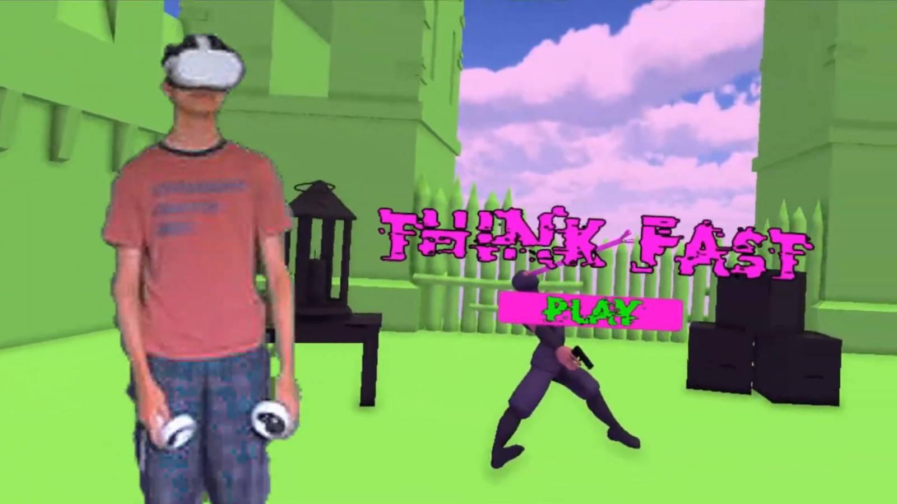
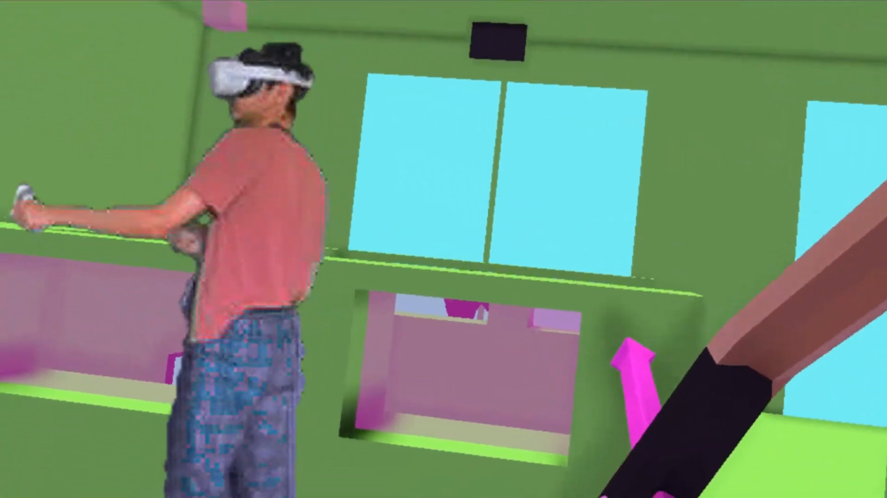
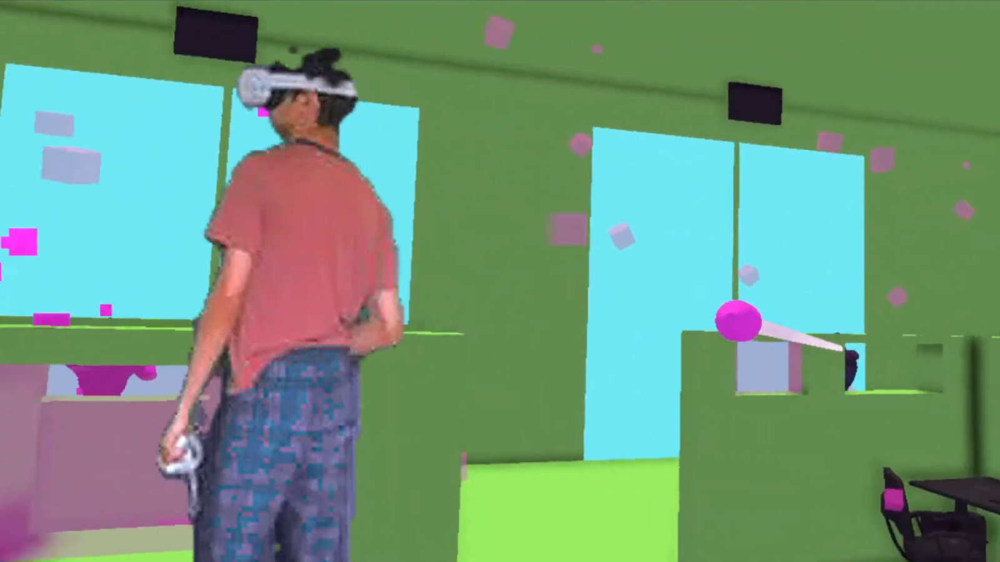

# Think_Fast (VR Game)
# Description: This VR game is an immersive experience that features a fully functional bow and arrow system, created in 2 weeks within the Unity Game Engine. Designed for the Oculus Quest 2, the game offers smooth and enjoyable gameplay, allowing players to interact in a stylized virtual world.
# I made an entertaining YouTube video about the process of making this VR Game: https://www.youtube.com/watch?v=sMBhKU0rXq0
#
#
#